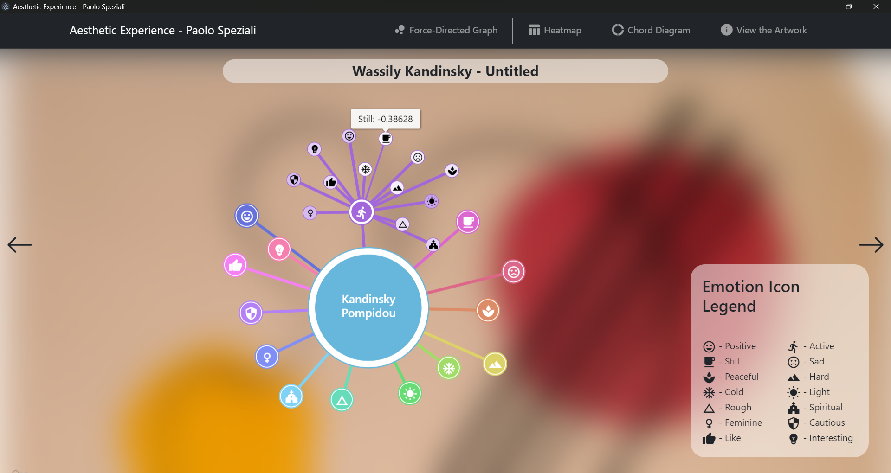
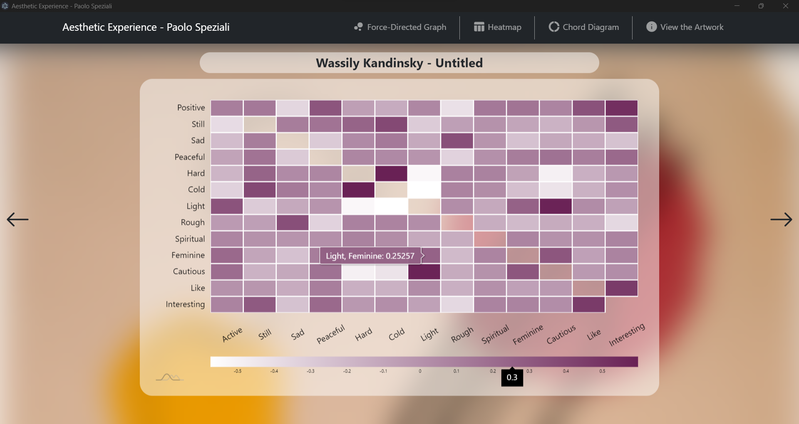
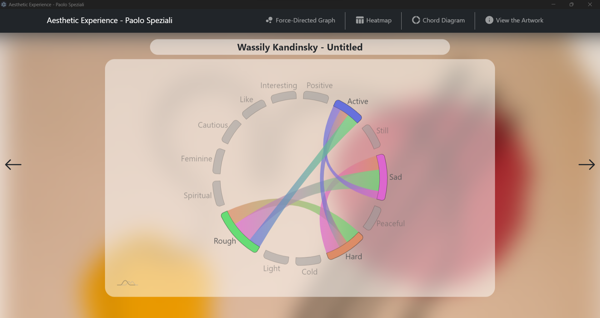
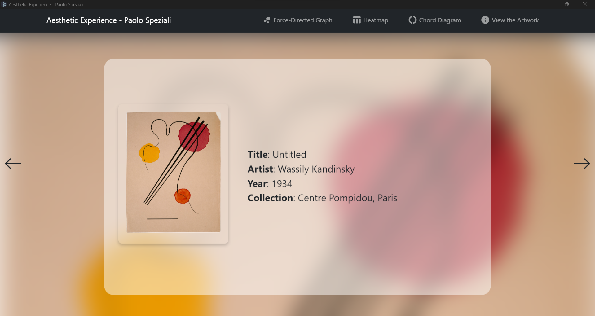

# Aesthetic Experience - Paolo Speziali

The following application is my project for the
Information Visualization and Visual Analysis
exam at University of Perugia.

## Features

- Visualize the aesthetic experience network dataset with the following charts:
    - Force-Directed Graph
    - Heatmap
    - Chord Diagram
- View the artwork associated with each experience.

## Installation

To run this application, make sure you have Node.js installed on your system. Then, follow these steps:

1. Clone this repository
2. Navigate to the project folder
3. Install dependencies with `npm install`
4. Start the application with `npm start`

## Dataset

The Aesthetic Experience Network dataset represents 8 networks that model the aesthetic
experience of viewers when observing each artwork. Each node models the polarity of an aesthetic
effect, such as positive/negative, active/passive, still/lively, and more. The edges in the graph
are weighted by conditional dependence relations among aesthetic effects, indicating dependencies
between them.

## Screenshots

